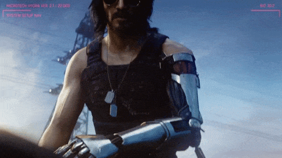

### Yo fellow nerds 🤓

Pronouns: he/him

I write some Rust, TypeScript, Zig, ...

Btw's: Neovim, Arch, and recently Void

Trilingual: `zh` (native), `en`, `ja`. Speaking and preferring `en-US` on the internet.

Currently working on: [Ollama Lab](https://github.com/chardoncs/ollama-lab)

### Stats

### Endnote

